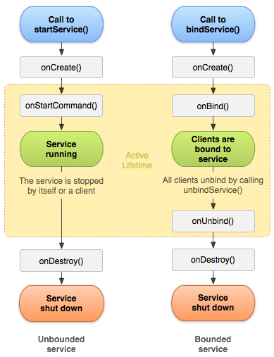

# 关于Service

它主要用于在后台处理一些耗时的逻辑，或者去执行某些需要长期运行的任务。必要的时候我们甚至可以在程序退出的情况下，让Service在后台继续保持运行状态。

## 1、简单使用步骤

首先，继承Service来定义Service：

    public class MyService extends Service {

        public static final String TAG = "MyService";

        @Override
        public void onCreate() {
            super.onCreate();
            Log.d(TAG, "onCreate() executed");
        }

        @Override
        public int onStartCommand(Intent intent, int flags, int startId) {
            Log.d(TAG, "onStartCommand() executed");
            return super.onStartCommand(intent, flags, startId);
        }

        @Override
        public void onDestroy() {
            super.onDestroy();
            Log.d(TAG, "onDestroy() executed");
        }

        @Override
        public IBinder onBind(Intent intent) {
            return new MyBinder();
        }

        class MyBinder extends Binder {  
            public void startDownload() {  
                Log.d("TAG", "startDownload() executed");  
            }   
        }  
    }

定义了Service之后还要在AndroidManifest.xml中注册：

    <service android:name="com.example.servicetest.MyService"/>  

然后，就可以使用该Service了：

    // 启动Service
    Intent startIntent = new Intent(this, MyService.class);
    startService(startIntent);  

    // 停止Service
    Intent stopIntent = new Intent(this, MyService.class);
    stopService(stopIntent);

    // 关联Service和Activity
    Intent bindIntent = new Intent(this, MyService.class);  
    bindService(bindIntent, connection, BIND_AUTO_CREATE);

    // 解除Service和Activity关联
    unbindService(connection);

    private ServiceConnection connection = new ServiceConnection() {  
  
        @Override  
        public void onServiceDisconnected(ComponentName name) {}  
  
        @Override  
        public void onServiceConnected(ComponentName name, IBinder service) {  
            myBinder = (MyService.MyBinder) service;  
            myBinder.startDownload();  
        }  
    };

### 总结

Service的生命周期图

1. 当第一次执行`startService(intent)`的时候，会调用该Service中的`onCreate()`和`onStartCommand()`方法。
2. 当第二次执行`startService(intent)`的时候，只会调用该Service中的onStartCommand()方法。（因此已经创建了服务，所以不需要再次调用onCreate()方法了）
3. `bindService()`方法的第三个参数是一个标志位，这里传入BIND_AUTO_CREATE表示在Activity和Service建立关联后自动创建Service，这会使得MyService中的`onCreate()`方法得到执行，但`onStartCommand()`方法不会执行。所以，在上面的程序中当调用了`bindService()`方法的时候，会执行的方法有，Service的`onCreate()`方法，以及ServiceConnection的`onServiceConnected()`方法。
4. 在3种中，如果想要停止Service，需要调用`unbindService()`才行。 
5. 如果我们既调用了`startService()`，又调用`bindService()`会怎么样呢？这时不管你是单独调用stopService()还是unbindService()，Service都不会被销毁，必要将两个方法都调用Service才会被销毁。也就是说，stopService()只会让Service停止，unbindService()只会让Service和Activity解除关联，一个Service必须要在既没有和任何Activity关联又处理停止状态的时候才会被销毁。

## 2、Service与线程

Service运行在主线程里的，也就是说如果你在Service里编写了非常耗时的代码，程序必定会出现ANR的。 

Service只意味着不需要前台UI的支持，即使Activity被销毁，或者程序被关闭，只要进程还在，Service就可以继续运行。但是我们可以在Service中再创建一个子线程，然后在这里去处理耗时逻辑。

虽然也可以在Activity中创建线程来执行耗时任务，但是它的缺点在于该线程只能与该Activity关联，其他Activity无法对其进行控制。

所以，标准的使用是：

    @Override
    public int onStartCommand(Intent intent, int flags, int startId) {
        new Thread(new Runnable() {
            @Override
            public void run() {
                // 开始执行后台任务  
            }
        }).start();
        return super.onStartCommand(intent, flags, startId);
    }

    class MyBinder extends Binder {

        public void startDownload() {
            new Thread(new Runnable() {
                @Override
                public void run() {
                    // 执行具体的下载任务  
                }
            }).start();
        }
    }

## 3、前台Service

因为Service的系统优先级较低，所以当系统出现内存不足情况时，就有可能会回收掉正在后台运行的Service。我们可以通过使用前台Service来解决Service可能被回收的问题。它的效果是在系统中显示一个驻留的通知。

前台服务的

    public class MyService extends Service {

        public static final String TAG = "MyService";

        @Override
        public void onCreate() {
            super.onCreate();
            Notification notification = new Notification(R.drawable.ic_launcher, 
                "Msg", System.currentTimeMillis());
            Intent intent = new Intent(this, MainActivity.class);
            PendingIntent pi = PendingIntent.getActivity(this, 0, intent, 0);
            notification.setLatestEventInfo(this, "Title", "Content", pi);
            startForeground(1, notification);
        }  
    }

## 4、远程Service

可以通过在AndroidManifest.xml中进行如下设置来将一个Service设置在非主线程中：

    <service  
        android:name="com.example.servicetest.MyService"  
        android:process=":remote" >  
    </service>  

也就说当前的Service运行在其他的进程了，不会阻碍主进行，从而也不会存在ANR了。但是这种方式中的Service是无法与Activity进行关联的，也就是说调用bindService()的时候会出现错误。如果我们想要将该Service与Activity进行关联，就需要使用AIDL进行跨进程通信了（IPC）。

要实现跨进程调用，我们可以按照如下步骤来实现：

首先，新建MyAIDLService.aidl文件：

    package com.example.servicetest;  
    interface MyAIDLService {  
        int plus(int a, int b);  
        String toUpperCase(String str);  
    }  

然后，我们要修改之前Service中的bind()方法：

    @Override  
    public IBinder onBind(Intent intent) {  
        return mBinder;  
    }

    MyAIDLService.Stub mBinder = new Stub() {  
  
        @Override  
        public String toUpperCase(String str) throws RemoteException {  
            if (str != null) {  
                return str.toUpperCase();  
            }  
            return null;  
        }  
  
        @Override  
        public int plus(int a, int b) throws RemoteException {  
            return a + b;  
        }  
    }; 

然后，我们在ServiceConnection中进行如下实现：

    private ServiceConnection connection = new ServiceConnection() {  
  
        @Override  
        public void onServiceDisconnected(ComponentName name) {}  
  
        @Override  
        public void onServiceConnected(ComponentName name, IBinder service) {  
            myAIDLService = MyAIDLService.Stub.asInterface(service);  
            try {  
                int result = myAIDLService.plus(3, 5);  
                String upperStr = myAIDLService.toUpperCase("hello world");  
            } catch (RemoteException e) {  
                e.printStackTrace();  
            }  
        }  
    };  

也就是使用MyAIDLService.Stub.asInterface()方法获取MyAIDLService，并调用MyAIDLService的方法。这时候再调用bindService()就不会出现错误了。

如果我们想要在其他进程（APP）中调用该Service，我们可以进行如下操作：

首先在Service添加Intent-Filter：

    <service android:name="com.example.servicetest.MyService"  
        android:process=":remote" >  
        <intent-filter>  
            <action android:name="com.example.servicetest.MyAIDLService"/>  
        </intent-filter>  
    </service>  

这样，我们就将该Service设置成其他程序可访问的了。

然后，在要访问该Service的程序中进行如下操作：

1. 将上述定义的MyAIDLService连同其包拷贝到当前程序中，即src目录下面。
2. 然后在绑定Service的时候按照下面的方式绑定：

        Intent intent = new Intent("com.example.servicetest.MyAIDLService");  
        bindService(intent, connection, BIND_AUTO_CREATE);  

        private ServiceConnection connection = new ServiceConnection() {

            @Override
            public void onServiceDisconnected(ComponentName name) {}

            @Override
            public void onServiceConnected(ComponentName name, IBinder service) {
                myAIDLService = MyAIDLService.Stub.asInterface(service);
                try {
                    int result = myAIDLService.plus(50, 50);
                    String upperStr = myAIDLService.toUpperCase("comes from ClientTest");
                } catch (RemoteException e) {
                    e.printStackTrace();
                }
            }
        };

这样我们就将该Service设置成了其他进程可访问的。

## 5、总结

### 5.1 Service 的生命周期 

Service有绑定模式和非绑定模式，以及这两种模式的混合使用方式。不同的使用方法生命周期方法也不同。 

1. 非绑定模式：当第一次调用`startService()`的时候执行的方法依次为`onCreate()`->`onStartCommand()`；当Service 关闭的时候调用`onDestory()`。
2. 绑定模式：第一次`bindService()`的时候，执行的方法为`onCreate()`->`onBind()`；解除绑定的时候会执行`onUnbind()`->`onDestory()`。
 
我们在开发的过程中还必须注意Service实例只会有一个，也就是说如果当前要启动的Service已经存在了那么就不会再次创建该Service当然也不会调用onCreate()方法。 

一个Service可以被多个客户进行绑定,只有所有的绑定对象都执行了onBind()方法后该Service才会销毁，不过如果有一个客户执行了onStart()方法,那么这个时候如果所有的bind客户都执行了 unBind()该Service也不会销毁。

### 5.2 IntentService

相比于一般的Service，IntentService具有的特征：

1. 会创建独立的线程来处理所有的Intent请求; 
2. 会创建独立的线程来处理onHandleIntent()方法实现的代码，无需处理多线程问题; 
3. 所有请求处理完成后，IntentService会自动停止,无需调用stopSelf()方法停止Service; 
4. 为Service的onBind()提供默认实现,返回null; 
5. 为Service的onStartCommand提供默认实现，将请求Intent添加到队列中。 
6. IntentService内置的是HandlerThread作为异步线程，每一个交给IntentService的任务都将以队列的方式逐个被执行到，一旦队列中有某个任务执行时间过长，那么就会导致后续的任务都会被延迟处理。正在运行的IntentService的程序相比起纯粹的后台程序更不容易被系统杀死，该程序的优先级是介于前台程序与纯后台程序之间的

### 5.3 如何提高service的优先级？

我们可以用 setForeground(true) 来设置Service的优先级。 当然这并不能保证你得Service永远不被杀掉，只是提高了他的优先级。

### 5.4 如何避免后台进程被杀死？

1. 调用startForegound()，让你的Service所在的线程成为前台进程
2. Service的onStartCommond()返回START_STICKY或START_REDELIVER_INTENT
3. Service的onDestroy()里面重新启动自己

参考：

1. [Android Service完全解析，关于服务你所需知道的一切(上)](http://blog.csdn.net/guolin_blog/article/details/11952435)
2. [Android Service完全解析，关于服务你所需知道的一切(下)](http://blog.csdn.net/guolin_blog/article/details/9797169)
