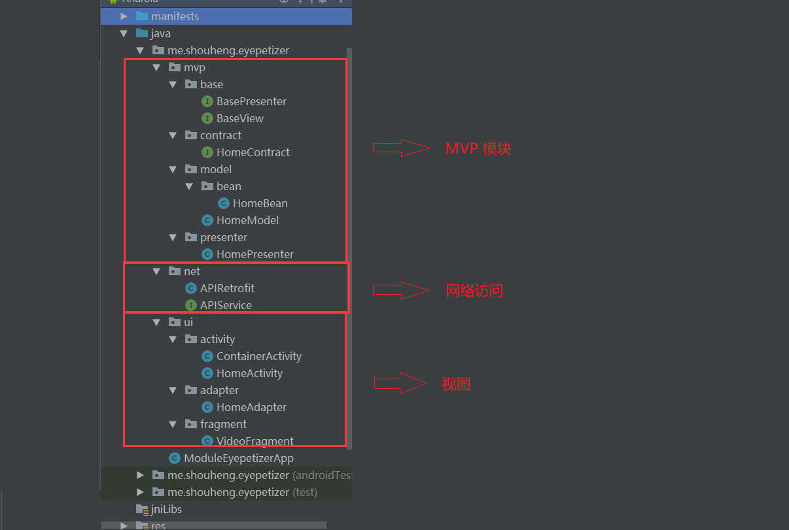

# 探索 Android 应用架构设计：MVC & MVP & MVVM & 组件化

MVC、MVP和MVVM是常见的三种架构设计模式，当前MVP和MVVM的使用相对比较广泛，当然MVC也并没有过时之说。而所谓的组件化就是指将应用根据业务需求划分成各个模块来进行开发，每个模块又可以编译成独立的APP进行开发。理论上讲，组件化和前面三种架构设计不是一个层次的。它们之间的关系是，组件化的各个组件可以使用前面三种架构设计。我们只有了解了这些架构设计的特点之后，才能在进行开发的时候选择适合自己项目的架构模式，这也是本文的目的。

## 1、MVC

MVC (Model-View-Controller, 模型-视图-控制器)，标准的MVC是这个样子的：

- 模型层 (Model)：业务逻辑对应的数据模型，无View无关，而与业务相关；
- 视图层 (View)：一般使用XML或者Java对界面进行描述；
- 控制层 (Controllor)：在Android中通常指Activity和Fragment，或者由其控制的业务类。

Activity并非标准的Controller，它一方面用来控制了布局，另一方面还要在Activity中写业务代码，造成了Activity既像View又像Controller。

在Android开发中，就是指直接使用Activity并在其中写业务逻辑的开发方式。显然，一方面Activity本身就是一个视图，另一方面又要负责处理业务逻辑，因此逻辑会比较混乱。

这种开发方式不太适合Android开发。

## 2、MVP

### 2.1 概念梳理

MVP (Model-View-Presenter) 是MVC的演化版本，几个主要部分如下：

- 模型层 (Model)：主要提供数据存取功能。
- 视图层 (View)：处理用户事件和视图。在Android中，可能是指Activity、Fragment或者View。
- 展示层 (Presenter)：负责通过Model存取书数据，连接View和Model，从Model中取出数据交给View。

所以，对于MVP的架构设计，我们有以下几点需要说明：

1. 这里的Model是用来存取数据的，也就是用来从指定的数据源中获取数据，不要将其理解成MVC中的Model。在MVC中Model是数据模型，在MVP中，我们用Bean来表示数据模型。
2. Model和View不会直接发生关系，它们需要通过Presenter来进行交互。在实际的开发中，我们可以用接口来定义一些规范，然后让我们的View和Model实现它们，并借助Presenter进行交互即可。

为了说明MVP设计模式，我们给出一个示例程序。你可以在[Github](https://github.com/Shouheng88/Android-references)中获取到它的源代码。

### 2.2 示例程序

在该示例中，我们使用了：

1. 开眼视频的API作为数据源；
2. Retrofit进行数据访问；
3. 使用ARouter进行路由；
4. 使用MVP设计模式作为程序架构。

下面是该模块的基本的包结构：



这里核心的代码是MVP部分。

这里我们首先定义了MVP模式中的最顶层的View和Presenter，在这里分别是`BaseView`和`BasePresenter`，它们在该项目中是两个空的接口，在一些项目中，我们可以根据自己的需求在这两个接口中添加自己需要的方法。

然后，我们定义了`HomeContract`。它是一个抽象的接口，相当于一层协议，用来规定指定的功能的View和Presenter分别应该具有哪些方法。通常，对于不同的功能，我们需要分别实现一个MVP，每个MVP都会又一个对应的Contract。笔者认为它的好处在于，将指定的View和Presenter的接口定义在一个接口中，更加集中。它们各自需要实现的方法也一目了然地展现在了我们面前。

这里根据我们的业务场景，该接口的定义如下：

    public interface HomeContract {

        interface IView extends BaseView {
            void setFirstPage(List<HomeBean.IssueList.ItemList> itemLists);
            void setNextPage(List<HomeBean.IssueList.ItemList> itemLists);
            void onError(String msg);
        }

        interface IPresenter extends BasePresenter {
            void requestFirstPage();
            void requestNextPage();
        }
    }

`HomeContract`用来规定View和Presenter应该具有的操作，在这里它用来指定主页的View和Presenter的方法。从上面我们也可以看出，这里的`IView`和`IPresenter`分别实现了`BaseView`和`BasePresenter`。

上面，我们定义了V和P的规范，MVP中还有一项Model，它用来从网络中获取数据。这里我们省去网络相关的具体的代码，你只需要知道`APIRetrofit.getEyepetizerService()`是用来获取Retrofit对应的Service，而`getMoreHomeData()`和`getFirstHomeData()`是用来从指定的接口中获取数据就行。下面是`HomeModel`的定义：

```
public class HomeModel {

    public Observable<HomeBean> getFirstHomeData() {
        return APIRetrofit.getEyepetizerService().getFirstHomeData(System.currentTimeMillis());
    }

    public Observable<HomeBean> getMoreHomeData(String url) {
        return APIRetrofit.getEyepetizerService().getMoreHomeData(url);
    }
}

```

OK，上面我们已经完成了Model的定义和View及Presenter的规范的定义。下面，我们就需要具体去实现View和Presenter。

首先是Presenter，下面是我们的`HomePresenter`的定义。在下面的代码中，为了更加清晰地展示其中的逻辑，我删减了一部分无关代码：

```
public class HomePresenter implements HomeContract.IPresenter {

    private HomeContract.IView view;

    private HomeModel homeModel;

    private String nextPageUrl;

    // 传入View并实例化Model
    public HomePresenter(HomeContract.IView view) {
        this.view = view;
        homeModel = new HomeModel();
    }

    // 使用Model请求数据，并在得到请求结果的时候调用View的方法进行回调
    @Override
    public void requestFirstPage() {
        Disposable disposable = homeModel.getFirstHomeData()
                // ....
                .subscribe(itemLists -> { view.setFirstPage(itemLists); },
                        throwable -> { view.onError(throwable.toString()); });
    }

    // 使用Model请求数据，并在得到请求结果的时候调用View的方法进行回调
    @Override
    public void requestNextPage() {
        Disposable disposable = homeModel.getMoreHomeData(nextPageUrl)
                // ....
                .subscribe(itemLists -> { view.setFirstPage(itemLists); },
                        throwable -> { view.onError(throwable.toString()); });
    }
}

```

从上面我们可以看出，在Presenter需要将View和Model建立联系。我们需要在初始化的时候传入View，并实例化一个Model。Presenter通过Model获取数据，并在拿到数据的时候，通过View的方法通知给View层。

然后，就是我们的View层的代码，同样，我对代码做了删减：

```
@Route(path = BaseConstants.EYEPETIZER_MENU)
public class HomeActivity extends CommonActivity<ActivityEyepetizerMenuBinding> implements HomeContract.IView {

    // 实例化Presenter
    private HomeContract.IPresenter presenter;
    {
        presenter = new HomePresenter(this);
    }

    @Override
    protected int getLayoutResId() {
        return R.layout.activity_eyepetizer_menu;
    }

    @Override
    protected void doCreateView(Bundle savedInstanceState) {
        // ...
        // 使用Presenter请求数据
        presenter.requestFirstPage();
        loading = true;
    }

    private void configList() {
        // ...
        getBinding().rv.addOnScrollListener(new RecyclerView.OnScrollListener() {
            @Override
            public void onScrolled(RecyclerView recyclerView, int dx, int dy) {
                    // 请求下一页的数据
                    presenter.requestNextPage();
                }
            }
        });
    }

    // 当请求到结果的时候在页面上做处理，展示到页面上
    @Override
    public void setFirstPage(List<HomeBean.IssueList.ItemList> itemLists) {
        loading = false;
        homeAdapter.addData(itemLists);
    }

    // 当请求到结果的时候在页面上做处理，展示到页面上
    @Override
    public void setNextPage(List<HomeBean.IssueList.ItemList> itemLists) {
        loading = false;
        homeAdapter.addData(itemLists);
    }

    @Override
    public void onError(String msg) {
        ToastUtils.makeToast(msg);
    }

    // ...
}
```

从上面的代码中我们可以看出实际在View中也要维护一个Presenter的实例。
当需要请求数据的时候会使用该实例的方法来请求数据，所以，在开发的时候，我们需要根据请求数据的情况，在Presenter中定义接口方法。

实际上，MVP的原理就是View通过Presenter获取数据，获取到数据之后再回调View的方法来展示数据。

## 3、MVC和MVP的区别：


MVC中是允许Model和View进行交互的，而MVP中很明显，Model与View之间的交互由Presenter完成。

MVP模式就是将P定义成一个接口，然后在每个触发的事件中调用接口的方法来处理，也就是将逻辑放进了P中，需要执行某些操作的时候调用P的方法就行了。

## 4、MVP的优缺点：

优点：

1. 降低耦合度，实现了Model和View真正的完全分离，可以修改View而不影响Modle
2. 模块职责划分明显，层次清晰
3. 隐藏数据
4. Presenter可以复用，一个Presenter可以用于多个View，而不需要更改Presenter的逻辑
5. 利于测试驱动开发。以前的Android开发是难以进行单元测试的
6. iew可以进行组件化。在MVP当中，View不依赖Model。

缺点：

1. Presenter中除了应用逻辑以外，还有大量的View->Model，Model->View的手动同步逻辑，造成Presenter比较笨重，维护起来会比较困难。
2. 由于对视图的渲染放在了Presenter中，所以视图和Presenter的交互会过于频繁。
3. 如果Presenter过多地渲染了视图，往往会使得它与特定的视图的联系过于紧密。一旦视图需要变更，那么Presenter也需要变更了。

